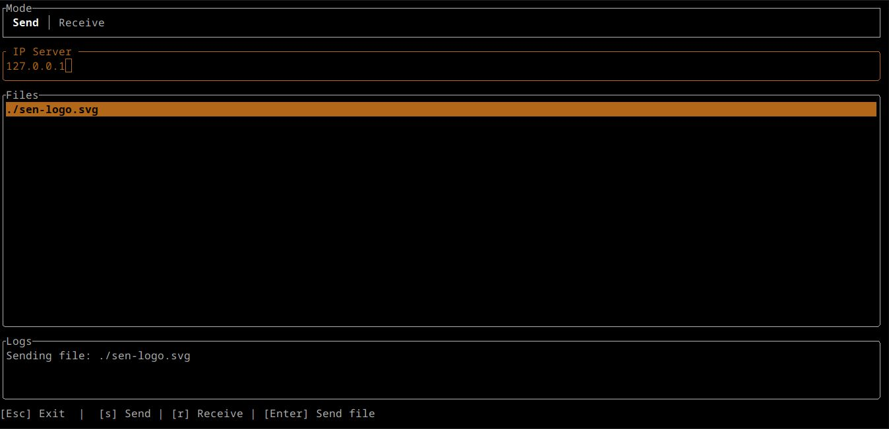
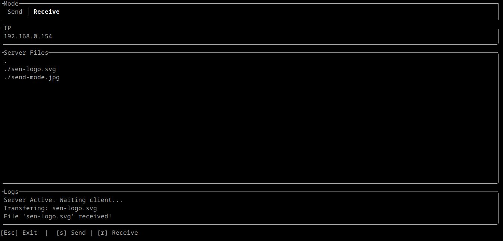

<div align="center">

<p>Sen is a file transfer tool</p>
</div>

## Installation

```bash
curl -fsSL https://raw.githubusercontent.com/hwisnu222/sen/main/install.sh | sudo bash
```

## Usage

```bash
sen
```

## Screenshots

Send file


Receive file

